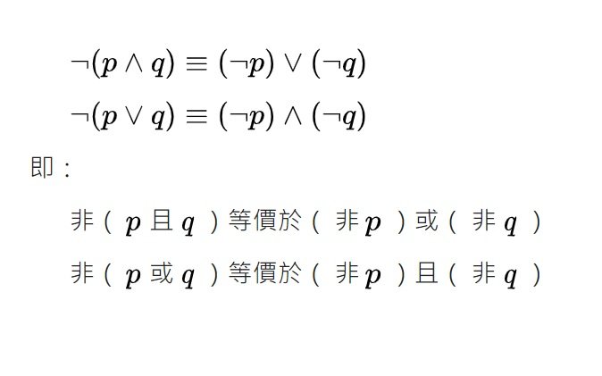
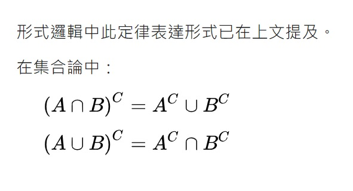

# 德摩根定律
在命題邏輯和邏輯代數中，德摩根定律是關於命題邏輯規律的一對法則。
19世紀英國數學家奧古斯塔斯·德摩根首先發現了在命題邏輯中存在著下面這些關係：

### 形式表示

# 布林邏輯
在布林邏輯中，只有用來代表真假值的簡單變數，像是 A, B, C, X, Y, Z .... 等，所以邏輯算式看來通常如下：
>* P & (P=>Q) => Q.
>* A & B & C => D | E.
>* -(A & B) <=> -A | -B.
這種布林命題邏輯裏沒有函數的概念，只有簡單的命題，因此布林邏輯也稱為命題邏輯。
# 謂詞邏輯
在謂詞邏輯裏，則有「布林函數」的概念，因此其表達能力較強，例如以下是一些謂詞邏輯的範例。
>* Parent(x,y) <= Father(x,y).
>* Parent(John, Johnson).
>* Ancestor(x,y) <= Parent(x,y).
>* Ancestor(x,y) <= Ancestor(x,z) & Parent(z,y).
可以看到在這種邏輯系統裏，有「布林變數」的概念 (像是 x, y, z 等等)，也有函數的概念，像是 Parent(), Father(), Ancestor() 等等。
# 一階邏輯
在上述這種謂詞邏輯系統中，如果我們加上 ∀ 或 ∃ 這兩個變數限定符號，而其中的謂詞不可以是變項，而必須要是常項，這種邏輯就稱為一階邏輯。
>* ∀People(x) => Mortal(x);人都會死。
>* people(Socrates);蘇格拉底是人。
>* Mortal(Socrates);所以蘇格拉底會死。
當然、規則可以更複雜，像是以下這個範例，就說明了「存在一些人可以永遠被欺騙」。
>* ∃x(Person(x)&∀y(Time(y) => Canfool(x,y))).
# 二階邏輯
如果一階邏輯中的謂詞，放寬成可以是變項的話 (這些變項可以加上 ∀ 或 ∃ 等符號的約束)，那就變成了二階邏輯，以下是一些二階邏輯的規則範例。
>* ∃P(P(x)&P(y)).
>* ∀P∀x(x∈P|x∉P).
>* ∀P(P(0)&∀y(P(y) => P(succ(y))) => ∀yP(y)).
---
### 參考文獻
https://zh.wikipedia.org/wiki/德摩根定律
https://ccckmit.github.io/aibook/htm/logic.html