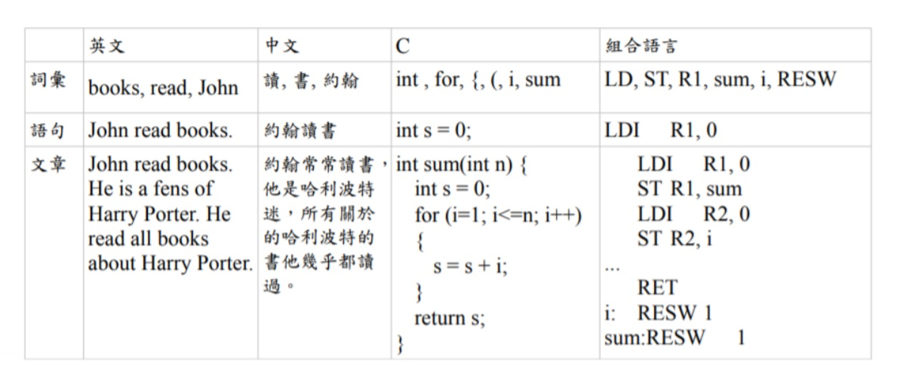
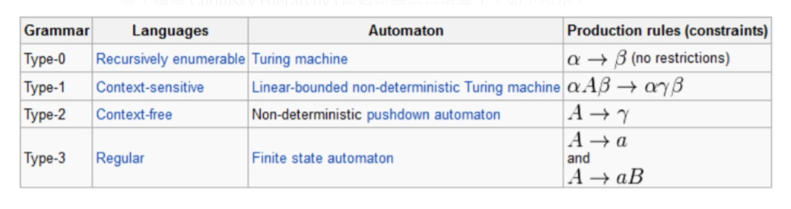
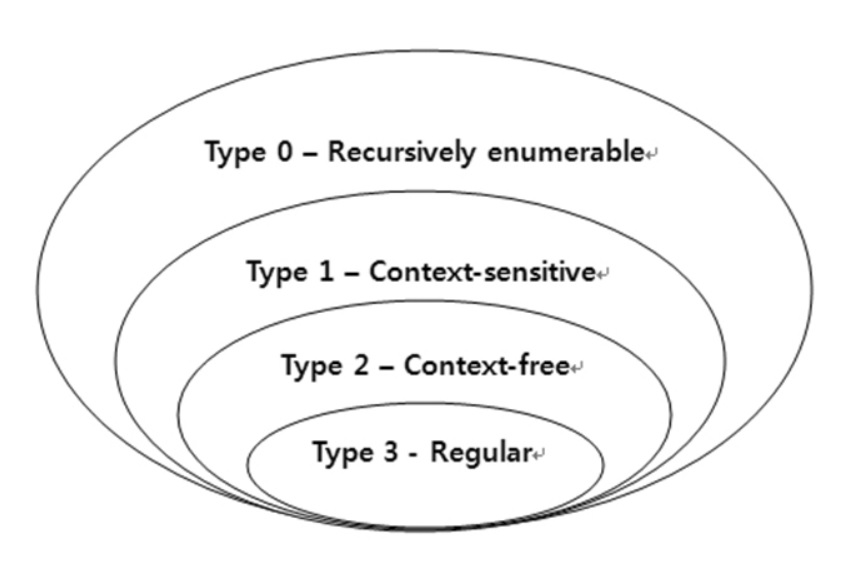

# 自然語言與人造語言
## 自然語言
自然語言（英語：Natural language）通常是指一種自然地隨文化演化的語言。漢語、英語、法語、西班牙語、葡萄牙文、日語、韓語、義大利文、德文為自然語言的例子。而世界語則為人工語言，即是一種由人特意為某些特定目的而創造的語言。

不過，有時所有人類使用的語言（包括上述自然地隨文化演化的語言，以及人工語言）都會被視為「自然」語言，以相對於如程式語言等為電腦而設的「人造」語言。這一種用法可見於自然語言處理一詞中。自然語言是人類交流和思維的主要工具。
## 人造語言
人造語言是許多因特定目的、用途，為了某特定使用族群，而人為創造出來的語言，包括文法、單字等等。人工語言不像自然語言一樣會隨人類的語言文化而發展，但是，它們在被創造之後，卻可能因而產生特定的影響力，隨著人類文化如真實語言一樣地演進。

人工語言可按創造意圖分為：
* 輔助語言
* 藝術語言
* 工程語言
## 語言的層次

# 喬姆斯基語言階層

* Type-0
```
Type-0的語言力最強的，基本上任何的語法規則您都可以撰寫而毫無限制，這種語言所能描述的語言稱為「遞歸可枚舉語言」(Recursive Enumerable,RE)，這種語言的能力在計算理論上可對應到圖靈機，也就相於是一台記憶體空間沒有上限的電腦所展現的能力。
```
* Type-1
```
Type-1語言的語法有點限制，因為每個規則的左邊至少要有一個非終端項目A，但其前後可以連接任意規則，這種語法所能描述的語言稱為「對上下文敏感的語言」(Context-Sensitive)，因為α可以決定之後是否要接Aβ，所以前後文之間是有關係的，因此才叫做「對上下文敏感的語言」。
這種語言在計算理論上可對應到「線性有界的非決定性圖靈機」，也就是一台「記憶體有限的電腦」。
```
* Type-2
```
Type-2語言的語法限制更大，因為規則左邊只能有一個非終端項目（以A代表），規則右邊則沒有限制，這種語言被稱為「上下文無關的語言」(Context Free)，在計算理論上可以對應到「非決定性的堆疊機(non-deterministic pushdown automaton)。
幾乎所有的程式語言都屬於Type-2的「上下文無關的語言」，這樣的程式語言處理起來也會比較簡單。雖然程式語言在語法上通常屬於Type-2，但其變數的型態與宣告等語意結構，卻是與上下文有關的，只是這個結構的處理通常是在「語意」層次去處理，而非在語法層次去處理的。
我們所常用的自然語言語法，像是「英文文法」、「中文文法」通常也是屬於Type-2語法，但是自然語言中的「指稱」，像是「你、我、他」，以及許多「語意」上的問題，也都是與上下文有關的，無法單純以Type-2的語法處理這些特性。
```
* Type-3
```
Type-3的語法限制是最多的，其規則的左右兩邊都最多只能有一個非終端項目（以A,B表示），而且右端的終端項目（以a表示）只能放在非終端項目B的前面。這種語言稱為「正規式」(Regular)，可用程式設計中的「正規表達式」(Regular Expression)表示，對應到計算理論中的有限狀態機(Finite State Automaton)。
```
下圖是這些語言之間的包含關係，也就是「Type-3 ⊂ Type-2 ⊂ Type-1 ⊂ Type-0」。


---
### 參考文獻
https://zh.wikipedia.org/zh-tw/自然语言
https://medium.com/人工智慧/語法理論-23bc87126e6
https://www.researchgate.net/figure/The-Chomsky-Hierarchy-is-a-series-of-increasingly-complex-classes-of-formal-languages_fig2_263634071