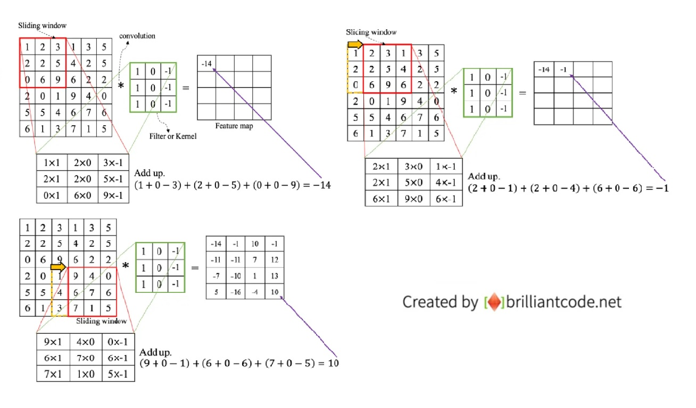
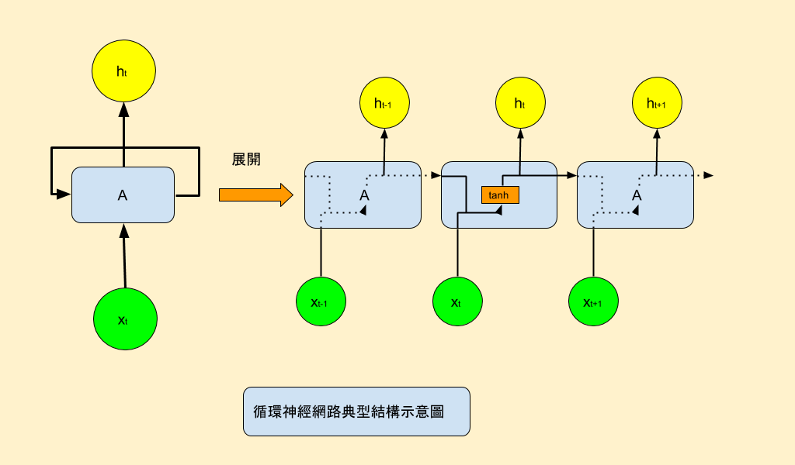
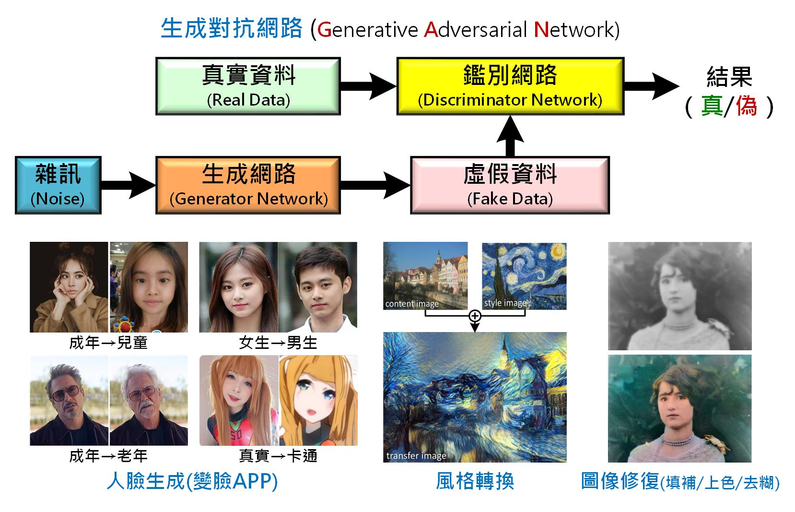

# 人工智慧的方法
### 比對法
* 紀錄問題與答案配對後，直接從表格內查出。
* 例如：Alex。
### 推理法
* 撰寫規則後，電腦根據規則推論。
* 例如：專家系統。
### 搜尋法
* 對所有可能的結果進行系統式的列舉，然後看看有沒有答案。
* 例如：深度優先、廣度優先、電腦下棋。
### 統計法
* 找出機率最大的解答。
* 例如：利用電腦亂數驗證中央極限定理。
### 優化法
* 對每個可能的解答，都給一個分數及權重，找出總分最好的解答。
* 例如：爬山演算法、遺傳演算法。
## 深度學習的神經網路
除了多層感知器以外，還有以下幾種神經網路：
* 卷積神經網路(CNN)
* 循環神經網路(RNN)
* 生成對抗網路(GAN)
### 卷積神經網路
卷積神經網路(CNN)是一種前饋神經網路，它的人工神經元可以回應一部分覆蓋範圍內的周圍單元，對於大型圖像處理有出色表現。

卷積神經網路由一個或多個卷積層和頂端的全連通層（對應經典的神經網路）組成，同時也包括關聯權重和池化層（pooling layer）。這一結構使得卷積神經網路能夠利用輸入資料的二維結構。與其他深度學習結構相比，卷積神經網路在圖像和語音辨識方面能夠給出更好的結果。這一模型也可以使用反向傳播演算法進行訓練。相比較其他深度、前饋神經網路，卷積神經網路需要考量的參數更少，使之成為一種頗具吸引力的深度學習結構。
* 卷積運算

### 循環神經網路
循環神經網路(RNN)是神經網路的一種。單純的循環神經網路因為無法處理隨著遞歸，權重指數級爆炸或梯度消失問題，難以捕捉長期時間關聯；而結合不同的LSTM（長短期記憶）可以很好解決這個問題。

時間循環神經網路可以描述動態時間行為，因為和前饋神經網路（feedforward neural network）接受較特定結構的輸入不同，循環神經網路將狀態在自身網路中循環傳遞，因此可以接受更廣泛的時間序列結構輸入。手寫識別是最早成功利用循環神經網路的研究結果。

下圖所示為Simple-RNN的神經網路示意圖。神經網路為A，通過讀取某個時間(狀態)的輸入xt，然後輸出一個值ht，循環可以使得信息從當前時間步傳遞到下一時間步。這些循環使得RNN可以被看作同一網路在不同時間步的多次循環，每個神經元會把更新的結果傳遞給下一個時間步，下圖右側即為循環展開的情形。

### 生成對抗網路
生成對抗網路(GAN)是非監督式學習的一種方法，通過讓兩個神經網路相互博弈的方式進行學習。該方法由伊恩·古德費洛等人於2014年提出。生成對抗網絡由一個生成網絡與一個判別網絡組成。生成網絡從潛在空間（latent space）中隨機取樣作為輸入，其輸出結果需要盡量模仿訓練集中的真實樣本。判別網絡的輸入則為真實樣本或生成網絡的輸出，其目的是將生成網絡的輸出從真實樣本中盡可能分辨出來。而生成網絡則要盡可能地欺騙判別網絡。兩個網絡相互對抗、不斷調整參數，最終目的是使判別網絡無法判斷生成網絡的輸出結果是否真實。

生成對抗網絡常用於生成以假亂真的圖片。此外，該方法還被用於生成影片、三維物體模型等。

雖然生成對抗網絡原先是為了無監督學習提出的，它也被證明對半監督學習、完全監督學習、強化學習是有用的。在一個2016年的研討會，楊立昆描述生成式對抗網絡是「機器學習這二十年來最酷的想法」。

---
### 參考文獻
https://zh.wikipedia.org/wiki/深度学习#深度神经网络
https://zh.wikipedia.org/wiki/卷积神经网络
https://www.brilliantcode.net/1584/convolutional-neural-networks-1-convolution-layer-stride-padding-kernel/
https://zh.wikipedia.org/wiki/循环神经网络
https://arbu00.blogspot.com/2017/05/3-rnn-recurrent-neural-networks.html
https://zh.wikipedia.org/wiki/生成对抗网络
https://aihub.org.tw/platform/specialist/article/d131b580-cd8a-11ea-b749-0242ac120002?page=