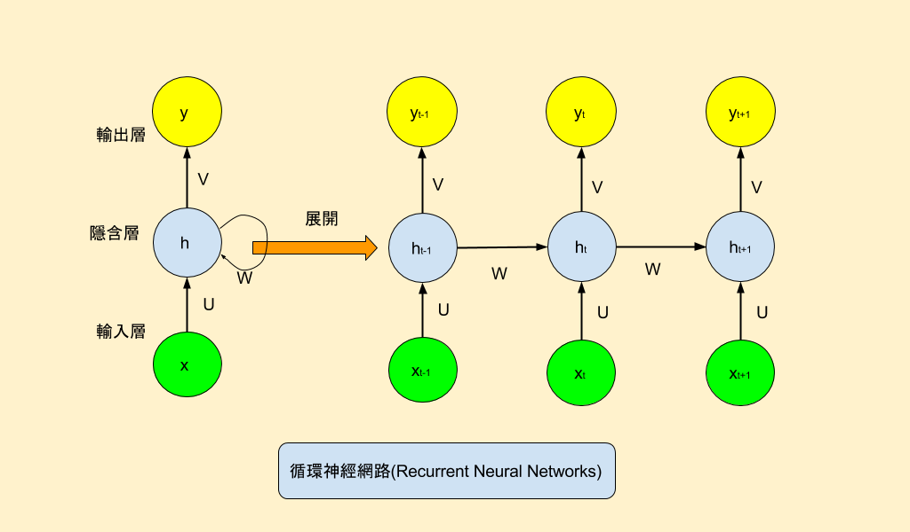
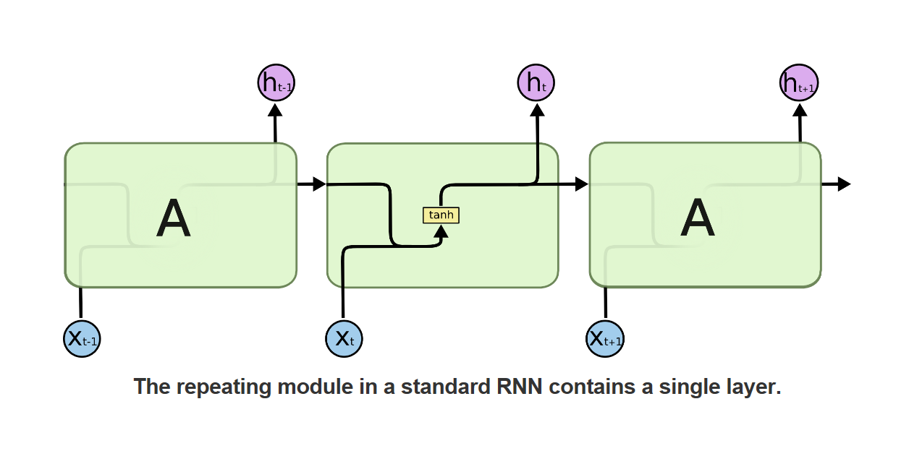

## colab
Colaboratory（也稱為Colab）是一個免費的Jupyter Notebook環境，它在雲端中運行，並將筆記本存儲在Google雲端端硬碟上。Colaboratory最初是Jupyter專案的一部分，但最終被Google接管。截止到2018年9月，Colaboratory只支援Python 2和Python 3核心，不支援其他Jupyter核心，比如Julia和R。
* 優點
  * 使用雲端空間，不用自己的電腦空間。
  * 可免費用 Colab 的 GPU 算力，執行深度學習速度有感。
  * 可以跳過 Mac 、 Win 的各種坑，設定省心。
  * 手機平板也可以執行，但建議只用來看成果，因為容易斷線且優化待加強。
* 缺點
  * 佔用 Google 雲端硬碟容量。
  * 部分功能及服務需付費。
  * 雲端服務一定要有網路。
## RNN
RNN是為了對序列數據進行建模而產生的。文本，是字母和詞彙的序列；語音，是音節的序列；視頻，是圖像的序列；氣象觀測數據，股票交易數據等等，也都是序列數據。

RNN背後的核心理念是利用序列的信息。傳統的神經網絡常常假設輸入（輸出）是獨立於彼此的，這對於某些應用來說是不可行的。 以下是RNN的典型結構：

## LSTM
長短期記憶(LSTM)是一種時間循環神經網路(RNN)，論文首次發表於1997年。由於獨特的設計結構，LSTM適合於處理和預測時間序列中間隔和延遲非常長的重要事件。

LSTM的表現通常比時間循環神經網路及隱馬爾科夫模型(HMM)更好，比如用在不分段連續手寫辨識上。2009年，用LSTM構建的人工神經網路模型贏得過ICDAR手寫辨識比賽冠軍。LSTM還普遍用於自主語音辨識，2013年運用TIMIT自然演講資料庫達成17.7%錯誤率的紀錄。作為非線性模型，LSTM可作為複雜的非線性單元用於構造更大型深度神經網路。

---
### 參考文獻
https://ai-stockboy.medium.com/我想學-python-a-i-該從何入手-e31ef8d8b2e2
https://hackmd.io/@wiimax/S1VGctnSS#優缺點比較
https://zh.wikipedia.org/wiki/Jupyter#Colaboratory
https://arbu00.blogspot.com/2017/05/3-rnn-recurrent-neural-networks.html
https://zh.wikipedia.org/wiki/長短期記憶
http://hemingwang.blogspot.com/2019/09/lstm.html