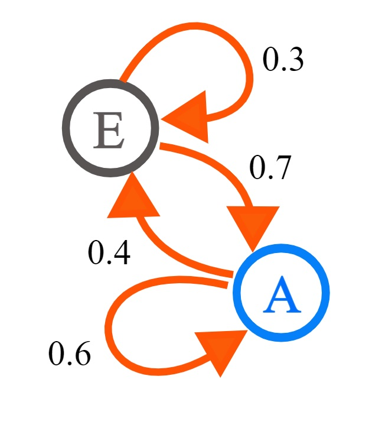
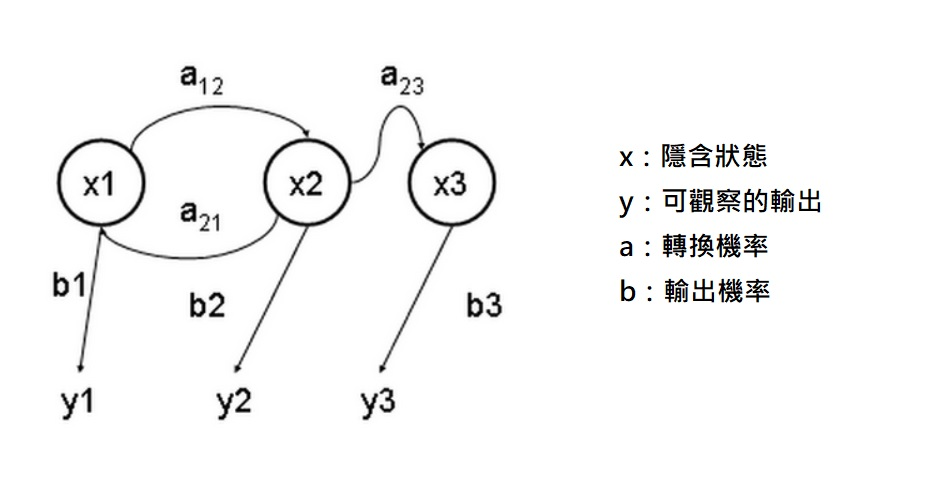
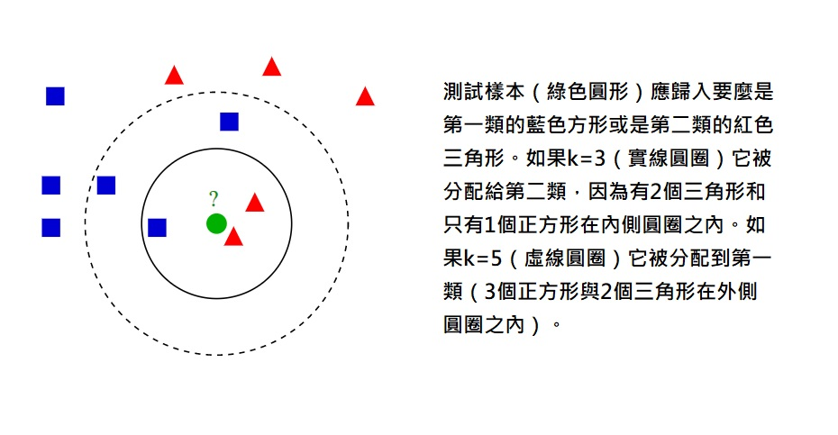

# 機器學習
機器學習是人工智慧的一個分支。人工智慧的研究歷史有著一條從以「推理」為重點，到以「知識」為重點，再到以「學習」為重點的自然、清晰的脈絡。顯然，機器學習是實現人工智慧的一個途徑，即以機器學習為手段解決人工智慧中的問題。機器學習在近30多年已發展為一門多領域交叉學科，涉及概率論、統計學、逼近論、凸分析、計算複雜性理論等多門學科。機器學習理論主要是設計和分析一些讓電腦可以自動「學習」的演算法。機器學習演算法是一類從資料中自動分析獲得規律，並利用規律對未知資料進行預測的演算法。因為學習演算法中涉及了大量的統計學理論，機器學習與推斷統計學聯絡尤為密切，也被稱為統計學習理論。演算法設計方面，機器學習理論關注可以實現的，行之有效的學習演算法。很多推論問題屬於無程式可循難度，所以部分的機器學習研究是開發容易處理的近似演算法。

機器學習已廣泛應用於資料探勘、電腦視覺、自然語言處理、生物特徵辨識、搜尋引擎、醫學診斷、檢測信用卡欺詐、證券市場分析、DNA序列測序、語音和手寫辨識、戰略遊戲和機器人等領域。

機器學習有下面幾種定義：
* 機器學習是一門人工智慧的科學，該領域的主要研究物件是人工智慧，特別是如何在經驗學習中改善具體演算法的效能。
* 機器學習是對能通過經驗自動改進的電腦演算法的研究。
* 機器學習是用資料或以往的經驗，以此最佳化電腦程式的效能標準。

機器學習可以分成下面幾種類別：
* 監督學習從給定的訓練資料集中學習出一個函式，當新的資料到來時，可以根據這個函式預測結果。監督學習的訓練集要求是包括輸入和輸出，也可以說是特徵和目標。訓練集中的目標是由人標註的。常見的監督學習演算法包括回歸分析和統計分類。（監督學習和非監督學習的差別就是訓練集目標是否人標註。他們都有訓練集且都有輸入和輸。）
* 無監督學習與監督學習相比，訓練集沒有人為標註的結果。常見的無監督學習演算法有生成對抗網路（GAN）、聚類。
* 半監督學習介於監督學習與無監督學習之間。
* 增強學習機器為了達成目標，隨著環境的變動，而逐步調整其行為，並評估每一個行動之後所到的回饋是正向的或負向的。
## 蒙地卡羅方法
蒙地卡羅方法（Monte Carlo method），也稱統計類比方法，是1940年代中期由於科學技術的發展和電腦的發明，而提出的一種以機率統計理論為指導的數值計算方法。是指使用亂數（或更常見的偽亂數）來解決很多計算問題的方法。與它對應的是確定性演算法。

蒙地卡羅方法可以粗略地分成兩類：
* 所求解的問題本身具有內在的隨機性，藉助電腦的運算能力可以直接類比這種隨機的過程。
* 所求解問題可以轉化為某種隨機分布的特徵數，比如隨機事件出現的機率，或者隨機變數的期望值。

工作過程：
* 用蒙地卡羅方法類比某一過程時，需要產生各種機率分布的隨機變數。
* 用統計方法把模型的數字特徵估計出來，從而得到實際問題的數值解。
### 下圖使用蒙地卡羅方法估算π值。放置30000個隨機點後,π的估算值與真實值相差0.07%

## 馬可夫鏈
馬可夫鏈（Markov chain），又稱離散時間馬可夫鏈（discrete-time Markov chain，DTMC），因俄國數學家安德烈·馬可夫得名，為狀態空間中經過從一個狀態到另一個狀態的轉換的隨機過程。該過程要求具備「無記憶」的性質：下一狀態的機率分布只能由當前狀態決定，在時間序列中它前面的事件均與之無關。這種特定類型的「無記憶性」稱作馬可夫性質。馬爾科夫鏈作為實際過程的統計模型具有許多應用。

在馬可夫鏈的每一步，系統根據機率分布，可以從一個狀態變到另一個狀態，也可以保持當前狀態。狀態的改變叫做轉移，與不同的狀態改變相關的機率叫做轉移機率。隨機漫步就是馬可夫鏈的例子。隨機漫步中每一步的狀態是在圖形中的點，每一步可以移動到任何一個相鄰的點，在這裡移動到每一個點的機率都是相同的（無論之前漫步路徑是如何的）。

* 討論不是互相獨立的一些事件。
* 下一狀態的機率分布只能由當前狀態決定，在時間序列中它前面的事件均與之無關。
* 種具有狀態的隨機過程。
* ex: 轉移矩陣的應用問題。

### 下圖為一個具有兩個轉換狀態的馬可夫鏈

## 吉布斯採樣
吉布斯採樣（Gibbs sampling）是統計學中用於馬爾科夫蒙特卡洛（MCMC）的一種算法，用於在難以直接採樣時從某一多變量概率分布中近似抽取樣本序列。該序列可用於近似聯合分布、部分變量的邊緣分布或計算積分（如某一變量的期望值）。某些變量可能為已知變量，故對這些變量並不需要採樣。

吉布斯採樣常用於統計推斷（尤其是貝葉斯推斷）之中。這是一種隨機化算法，與最大期望算法等統計推斷中的確定性算法相區別。與其他MCMC算法一樣，吉布斯採樣從馬爾科夫鏈中抽取樣本，可以看作是Metropolis–Hastings算法的特例。
## 隱藏式馬可夫模型
隱藏式馬可夫模型（Hidden Markov Model，HMM）或稱作隱性馬可夫模型，是統計模型，它用來描述一個含有隱含未知參數的馬可夫過程。其難點是從可觀察的參數中確定該過程的隱含參數。然後利用這些參數來作進一步的分析，例如圖型識別。

在正常的馬可夫模型中，狀態對於觀察者來說是直接可見的。這樣狀態的轉換機率便是全部的參數。而在隱藏式馬可夫模型中，狀態並不是直接可見的，但受狀態影響的某些變數則是可見的。每一個狀態在可能輸出的符號上都有一機率分布。因此輸出符號的序列能夠透露出狀態序列的一些資訊。

### 下圖為隱藏式馬可夫模型狀態變遷圖的一個例子

## 維特比演算法
維特比演算法（Viterbi algorithm）是一種動態規劃演算法。它用於尋找最有可能產生觀測事件序列的維特比路徑——隱含狀態序列，特別是在馬可夫資訊源上下文和隱藏式馬可夫模型中。

術語「維特比路徑」和「維特比演算法」也被用於尋找觀察結果最有可能解釋相關的動態規划算法。例如在統計句法分析中動態規划算法可以被用於發現最可能的上下文無關的衍生（解析）的字串，有時被稱為「維特比分析」。

維特比演算法由安德魯·維特比（Andrew Viterbi）於1967年提出，用於在數字通信鏈路中解摺積以消除噪音。此演算法被廣泛應用於CDMA和GSM數字蜂巢式網路、撥號數據機、衛星、深空通信和802.11無線網路中解摺積碼。現今也被常常用於語音辨識、關鍵字辨識、計算語言學和生物資訊學中。例如在語音（語音辨識）中，聲音訊號做為觀察到的事件序列，而文字字串，被看作是隱含的產生聲音訊號的原因，因此可對聲音訊號應用維特比演算法尋找最有可能的文字字串。

### 下圖為一維特比演算法的例子

 >想像一個鄉村診所。村民有著非常理想化的特性，要麼健康要麼發燒。他們只有問診所的醫生的才能知道是否發燒。 聰明的醫生通過詢問病人的感覺診斷他們是否發燒。村民只回答他們感覺正常、頭暈或冷。
 假設一個病人每天來到診所並告訴醫生他的感覺。醫生相信病人的健康狀況如同一個離散馬可夫鏈。病人的狀態有兩種「健康」和「發燒」，但醫生不能直接觀察到，這意味著狀態對他是「隱含」的。每天病人會告訴醫生自己有以下幾種由他的健康狀態決定的感覺的一種：正常、冷或頭暈。這些是觀察結果。
 整個系統為一個隱藏式馬可夫模型。


## EM演算法
在統計中被用於尋找，依賴於不可觀察的隱性變量的概率模型中，參數的最大似然估計。
### em.py
* 執行結果
```
python -u "c:\Users\User\ai\06-learn\05-em\em.py"
pA=[0.6, 0.4] pB=[0.5, 0.5] delta=9.9999
pA=[0.71301224 0.28698776] pB=[0.58133931 0.41866069] delta=0.11301223540051619
pA=[0.74529204 0.25470796] pB=[0.56925575 0.43074425] delta=0.0322798006814784
pA=[0.76809883 0.23190117] pB=[0.54953591 0.45046409] delta=0.022806798285326613
pA=[0.78316458 0.21683542] pB=[0.53461745 0.46538255] delta=0.015065749932652417
pA=[0.79105525 0.20894475] pB=[0.52628117 0.47371883] delta=0.008336287117588381
pA=[0.79453254 0.20546746] pB=[0.52239044 0.47760956] delta=0.003890729512057156
pA=[0.79592867 0.20407133] pB=[0.52072988 0.47927012] delta=0.001660559431849007
```
## K-近鄰演算法
在圖型識別領域中，最近鄰居法（KNN演算法，又譯K-近鄰演算法）是一種用於分類和迴歸的無母數統計方法。在這兩種情況下，輸入包含特徵空間（Feature Space）中的k個最接近的訓練樣本。
* 在k-NN分類中，輸出是一個分類族群。一個物件的分類是由其鄰居的「多數表決」確定的，k個最近鄰居（k為正整數，通常較小）中最常見的分類決定了賦予該物件的類別。若k = 1，則該物件的類別直接由最近的一個節點賦予。
* 在k-NN迴歸中，輸出是該物件的屬性值。該值是其k個最近鄰居的值的平均值。
最近鄰居法採用向量空間模型來分類，概念為相同類別的案例，彼此的相似度高，而可以藉由計算與已知類別案例之相似度，來評估未知類別案例可能的分類。

### 下圖為K-近鄰演算法例子。

## 決策樹
決策論中 （如風險管理），決策樹（Decision tree）由一個決策圖和可能的結果（包括資源成本和風險）組成， 用來創建到達目標的規劃。決策樹建立並用來輔助決策，是一種特殊的樹結構。決策樹是一個利用像樹一樣的圖形或決策模型的決策支持工具，包括隨機事件結果，資源代價和實用性。它是一個算法顯示的方法。決策樹經常在運籌學中使用，特別是在決策分析中，它幫助確定一個能最可能達到目標的策略。如果在實際中，決策不得不在沒有完備知識的情況下被在線採用，一個決策樹應該平行概率模型作為最佳的選擇模型或在線選擇模型算法。決策樹的另一個使用是作為計算條件概率的描述性手段。

機器學習中，決策樹是一個預測模型；他代表的是對象屬性與對象值之間的一種映射關係。樹中每個節點表示某個對象，而每個分叉路徑則代表某個可能的屬性值，而每個葉節點則對應從根節點到該葉節點所經歷的路徑所表示的對象的值。決策樹僅有單一輸出，若欲有複數輸出，可以建立獨立的決策樹以處理不同輸出。 數據挖掘中決策樹是一種經常要用到的技術，可以用於分析數據，同樣也可以用來作預測。

一個決策樹包含三種類型的節點：
* 1. 決策節點：通常用矩形框來表示
* 2. 機會節點：通常用圓圈來表示
* 3. 終結點：通常用三角形來表示
### 下圖為一決策數模型


決策樹學習也是數據挖掘中一個普通的方法。在這裡，每個決策樹都表述了一種樹型結構，它由它的分支來對該類型的對象依靠屬性進行分類。每個決策樹可以依靠對源資料庫的分割進行數據測試。這個過程可以遞歸式的對樹進行修剪。 當不能再進行分割或一個單獨的類可以被應用於某一分支時，遞歸過程就完成了。另外，隨機森林分類器將許多決策樹結合起來以提升分類的正確率。
---
### 參考文獻
https://zh.wikipedia.org/wiki/机器学习
https://zh.wikipedia.org/wiki/蒙地卡羅方法
https://zh.wikipedia.org/wiki/马尔可夫链
https://zh.wikipedia.org/wiki/吉布斯采样
https://zh.wikipedia.org/wiki/隐马尔可夫模型
https://zh.wikipedia.org/wiki/维特比算法
https://zh.wikipedia.org/wiki/最大期望算法
https://zh.wikipedia.org/wiki/K-近邻算法
https://zh.wikipedia.org/wiki/决策树