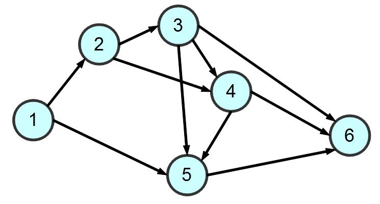

# 線性規劃
在數學中，線性規劃（Linear Programming，簡稱LP）特指目標函數和約束條件皆為線性的最佳化問題。

線性規劃是最佳化問題中的一個重要領域。在作業研究中所面臨的許多實際問題都可以用線性規劃來處理，特別是某些特殊情況，例如：網路流、多商品流量等問題，都被認為非常重要。目前已有大量針對線性規劃演算法的研究。很多最佳化問題算法都可以分解為線性規劃子問題，然後逐一求解。在線性規劃的歷史發展過程中所衍伸出的諸多概念，建立了最佳化理論的核心思維，例如「對偶」、「分解」、「凸集」的重要性及其一般化等。在微觀經濟學和商業管理領域中，線性規劃亦被大量應用於例如降低生產過程的成本等手段，最終提升產值與營收。對線性規劃有早期貢獻的列昂尼德·維塔利耶維奇·康托羅維奇和特亞林·科普曼斯於1975年共同獲得諾貝爾經濟學獎。
# NP完全
NP完全是計算複雜度理論中，決定性問題的等級之一。NP完備是NP與NP困難的交集，是NP中最難的決定性問題，所有NP問題都可以被快速歸化為NP完備問題。因此NP完備問題應該是最不可能被化簡為P（多項式時間可決定）的決定性問題的集合。若任何NPC問題得到多項式時間的解法，那此解法就可應用在所有NP問題上。
# 整數規劃
* 要求所有的未知量都為整數的線性規劃問題叫做整數規劃（integer programming, IP）或整數線性規劃（integer linear programming, ILP）問題。相對於即使在最壞情況下也能有效率地解出的線性規劃問題，整數規劃問題的最壞情況是不確定的，在某些實際情況中（有約束變量的那些）為NP困難問題。
* 0-1整數規劃是整數規劃的特殊情況，所有的變量都要是0或1（而非任意整數）。這類問題亦被分類為NP困難問題。
* 只要求當中某幾個未知數為整數的線性規劃問題叫做混合整數規劃（mixed integer programming, MIP）問題。這類問題通常亦被分類為NP困難問題。
* 只要求當中某幾個未知數為整數的線性規劃問題叫做混合整數規劃（mixed integer programming, MIP）問題。這類問題通常亦被分類為NP困難問題。
* 存在著幾類IP和MIP的子問題，它們可以被有效率地解出，最值得注意的一類是具有完全單位模約束矩陣，和約束條件的右邊全為整數的一類。
* 一個解決大型整數線性規劃問題的先進演算法為delayed column generation。
# 單純形法
單純形法（simplex algorithm）在數學優化領域中常用於線性規劃問題的數值求解，由喬治·伯納德·丹齊格發明。

下山單純形法（Nelder-Mead method）與單純形法名稱相似，但二者關聯不大。該方法由Nelder和Mead於1965年發明，是用於優化多維無約束問題的一種數值方法，屬於更普遍的搜索算法的類別。這兩種方法都使用了單純形的概念。單純形是N維中的N+1個頂點的凸包，是一個多胞體：直線上的一個線段，平面上的一個三角形，三維空間中的一個四面體等等，都是單純形。
# 泡沫排序
泡沫排序是一種簡單的排序演算法。它重複地走訪過要排序的數列，一次比較兩個元素，如果他們的順序錯誤就把他們交換過來。走訪數列的工作是重複地進行直到沒有再需要交換，也就是說該數列已經排序完成。這個演算法的名字由來是因為越小的元素會經由交換慢慢「浮」到數列的頂端。

泡沫排序對n個項目需要O(n^2)的比較次數，且可以原地排序。儘管這個演算法是最簡單瞭解和實作的排序演算法之一，但它對於包含大量的元素的數列排序是很沒有效率的。

泡沫排序是與插入排序擁有相等的執行時間，但是兩種演算法在需要的交換次數卻很大地不同。在最壞的情況，泡沫排序需要O(n^2)次交換，而插入排序只要最多O(n)交換。泡沫排序的實現（類似下面）通常會對已經排序好的數列拙劣地執行O(n^2)，而插入排序在這個例子只需要O(n)個運算。因此很多現代的演算法教科書避免使用泡沫排序，而用插入排序取代之。泡沫排序如果能在內部迴圈第一次執行時，使用一個旗標來表示有無需要交換的可能，也可以把最優情況下的複雜度降低到O(n)。在這個情況，已經排序好的數列就無交換的需要。若在每次走訪數列時，把走訪順序反過來，也可以稍微地改進效率。有時候稱為雞尾酒排序，因為演算法會從數列的一端到另一端之間穿梭往返。

泡沫排序演算法的運作如下：
>1. 比較相鄰的元素。如果第一個比第二個大，就交換他們兩個。
>2. 對每一對相鄰元素作同樣的工作，從開始第一對到結尾的最後一對。這步做完後，最後的元素會是最大的數。
>3. 針對所有的元素重複以上的步驟，除了最後一個。
>4. 持續每次對越來越少的元素重複上面的步驟，直到沒有任何一對數字需要比較。
# 循序搜尋法
從第一個資料開始取出，依序一一與「目標資料」相互比較，直到找到所要元素或所有資料均尋找完為止，此方法稱「循序搜尋」。
# 圖形搜尋
圖形搜尋的方法大致可以分為「深度優先搜尋 (Depth-First Search, DFS)、廣度優先搜尋 (Breath-First Search, BFS)、最佳優先搜尋 (Best-First Search, BestFS) 等三類。


## 深度優先搜尋
這個演算法會儘可能深的搜尋樹的分支。當節點v的所在邊都己被探尋過，搜尋將回溯到發現節點v的那條邊的起始節點。這一過程一直進行到已發現從源節點可達的所有節點為止。如果還存在未被發現的節點，則選擇其中一個作為源節點並重複以上過程，整個行程反覆進行直到所有節點都被存取為止。


## 廣度優先搜尋
廣度優先搜尋是從一個節點開始，將每個鄰居節點都一層一層的走訪下去，深度最淺的節點會優先被走訪的方式。


## 最佳優先搜尋
深度搜尋會猛衝亂衝，而廣度搜尋則會耗費太多的記憶體，並且沒有效率，無法很快的找到目標點。假如能夠知道哪些點距離目標點最近，也就是哪些點比較好的話，就能採用最佳優先搜尋來搜尋。

最佳優先搜尋的實作方法與廣度優先搜尋類似，但是並不採用佇列，而是採用一種根據優先程度排序的結構，每次都取出最好的那個繼續進行搜尋。
## graph_search.py
* 執行結果
```
dfs:1 => 2 => 3 => 4 => 5 => 6 =>
bfs:1 => 2 => 5 => 3 => 4 => 6 =>
```
---
### 參考文獻
https://zh.wikipedia.org/wiki/线性规划
https://zh.wikipedia.org/wiki/单纯形法
https://zh.wikipedia.org/wiki/NP完全
https://zh.wikipedia.org/wiki/冒泡排序
http://spaces.isu.edu.tw/upload/18833/3/web/search.htm
http://programmermagazine.github.io/201406/htm/focus1.html