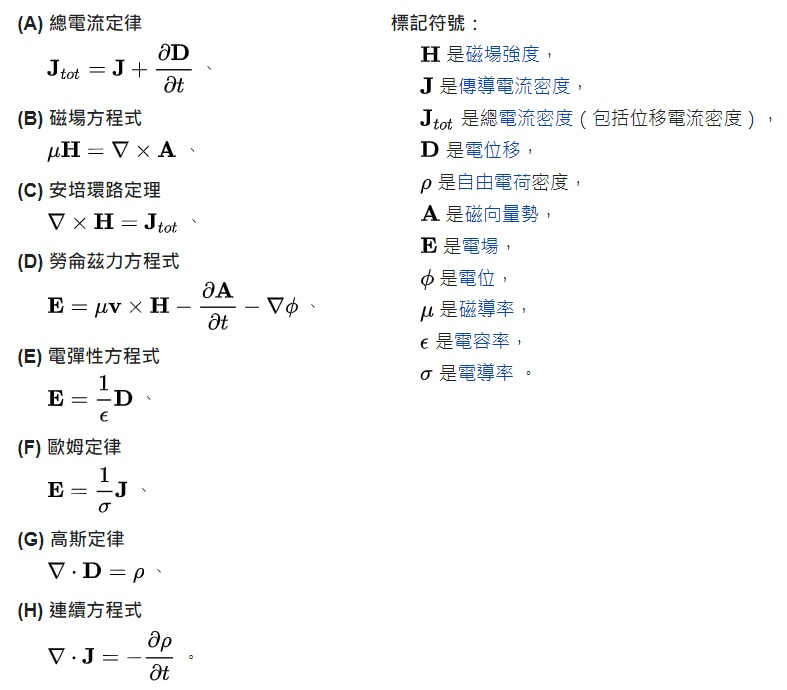

# 數學架構: 集合、邏輯、函數、關係、證明
## [代數](https://zh.wikipedia.org/zh-tw/%E4%BB%A3%E6%95%B0)
* [代數學](https://zh-yue.wikipedia.org/wiki/%E4%BB%A3%E6%95%B8%E5%AD%B8)
* [線性代數](https://zh.wikipedia.org/wiki/%E7%BA%BF%E6%80%A7%E4%BB%A3%E6%95%B0)
* [群論](https://zh.wikipedia.org/zh-tw/%E7%BE%A4%E8%AE%BA)
* [伽羅瓦理論](https://zh.wikipedia.org/zh-tw/%E4%BC%BD%E7%BE%85%E7%93%A6%E7%90%86%E8%AB%96)
* [數論](https://zh.wikipedia.org/zh-tw/%E6%95%B0%E8%AE%BA)
## [幾何](https://zh-yue.wikipedia.org/wiki/%E5%B9%BE%E4%BD%95%E5%AD%B8)
* [歐氏幾何](https://zh.wikipedia.org/zh-tw/%E6%AC%A7%E5%87%A0%E9%87%8C%E5%BE%97%E5%87%A0%E4%BD%95)
* [解析幾何](https://zh.wikipedia.org/zh-tw/%E8%A7%A3%E6%9E%90%E5%87%A0%E4%BD%95)
* [非歐幾何](https://zh.wikipedia.org/zh-tw/%E9%9D%9E%E6%AC%A7%E5%87%A0%E9%87%8C%E5%BE%97%E5%87%A0%E4%BD%95)
* [微分幾何](https://zh.wikipedia.org/zh-tw/%E5%BE%AE%E5%88%86%E5%87%A0%E4%BD%95)
## [分析](https://zh.wikipedia.org/zh-tw/%E6%95%B0%E5%AD%A6%E5%88%86%E6%9E%90)
* [微積分](https://zh.wikipedia.org/zh-tw/%E5%BE%AE%E7%A7%AF%E5%88%86%E5%AD%A6)
* [微分方程](https://zh.wikipedia.org/zh-tw/%E5%BE%AE%E5%88%86%E6%96%B9%E7%A8%8B)
* [實函數](https://zh.wikipedia.org/zh-tw/%E5%AE%9E%E5%87%BD%E6%95%B0)
* [複分析](https://zh.wikipedia.org/wiki/%E8%A4%87%E5%88%86%E6%9E%90)
---
# 電磁場的動力學理論
《電磁場的動力學理論》是一篇詹姆斯·馬克士威發於1864年的論文，這篇論文是他所寫的第三篇關於電磁學的論文。在這篇論文裏，他首次系統性地陳列出馬克士威方程組。馬克士威又應用了先前在他的1861年論文《論物理力線》裏提出的位移電流的概念，來推導出電磁波方程式。由於這導引將電學、磁學和光學聯結成一個統一理論。這創舉現在已被物理學術界公認為物理學史的重大里程碑。

這篇論文明確地闡明，能量儲存於電磁場內。因此，它在歷史上首先建立了場論的基礎概念。
## 馬克士威原本的方程式
在這篇論文的標題為電磁場一般方程式的第三章裏，馬克士威列出了涉及二十個未知量的二十個方程式，在那時期，稱為馬克士威方程組。由於向量微積分尚在發展中，這二十個方程式都是以分量形式表示，其中，有十八個方程式可以用六個向量方程式集中表示（對應於每一個直角坐標，有一個方程式），另外剩下的兩個是純量方程式。所以，以向量標記，馬克士威方程組可以表示為八個方程式。1884年，從這八個方程式，奧利弗·黑維塞重新編排出四個方程式，並且稱這一組方程式為馬克士威方程組。今天廣泛使用的馬克士威方程組就是黑維塞編成的這一組方程式。

黑維塞版本的馬克士威方程組是以現代向量標記法寫出。在原先版本的八個方程式裏，只有一個方程式，高斯定律的方程式(G)，完整不變地出現於黑維塞版本。另外一個在黑維塞版本的方程式，乃是由總電流定律的方程式(A)與安培環路定理的方程式(C)共同湊合而成。這方程式包含了馬克士威的位移電流，是安培環路定理的延伸。

---
### 參考文獻
https://zh.wikipedia.org/wiki/電磁場的動力學理論