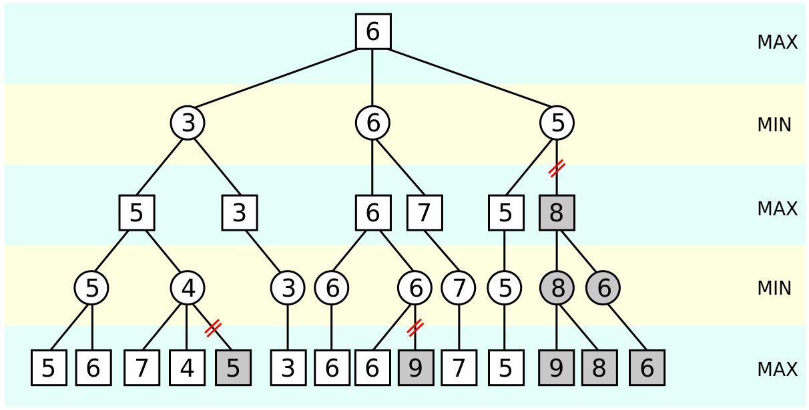

# MiniMax對局搜尋演算法
MiniMax算法常用於棋類等由兩方較量的遊戲和程序。該算法是一個零總和算法，即一方要在可選的選項中選擇將其優勢最大化的選擇，另一方則選擇令對手優勢最小化的方法。而開始的時候總和為0。很多棋類遊戲可以採取此算法，例如圈圈叉叉。

在下棋的時候，如果要打敗對手，必須考量讓自己得分最多，且讓對手得分最少，Min-Max 正是根據這樣的想法而設計出來的。
必須注意的是，當電腦要下一子之前，當然會下讓自己得分最多的那一格，但是這很容易會落入對手的陷阱，因為得分最多的那一格很可能接下來失分更多。
於是、一個合理的想法是將所有層次分為「敵我雙方」兩類，我方下的那層得分越多越好，而對方下的那層失分越少越好。
而且、我們不能假設對方是個笨蛋，因此在每一層上，我們都必須認為「對方可能會下出讓我們失分最多的一步」，而我們必須盡可能選擇「最大失分最小化」的策略，這種想法就導出了「Min-Max 對局搜尋法」，以下是一個範例。


在上圖中、由於第 0 層代表我方下，所以我們取在第一層失分少的步驟，而第 1 層代表敵方下，所以假設他們也會採取對他們最有利的下法 (也就是對我們最不利的、讓我們失分多的) ，整張圖的推論邏輯就在這種 Min-Max 的過程中完成了。

必須補充說明的是，圖中的 -∞ 與 +∞ 通常代表該節點為樹葉節點，也就是整盤棋已經結束。換句話說、有人輸了或贏了。
* 演算法
```c++
function minimax(node, depth, maximizingPlayer)
    if depth = 0 or node is a terminal node
        return the heuristic value of node
    if maximizingPlayer
        bestValue := -∞
        for each child of node
            val := minimax(child, depth - 1, FALSE))
            bestValue := max(bestValue, val);
        return bestValue
    else
        bestValue := +∞
        for each child of node
            val := minimax(child, depth - 1, TRUE))
            bestValue := min(bestValue, val);
        return bestValue

(* Initial call for maximizing player *)
minimax(origin, depth, TRUE)
```
# Alpha-Beta修剪法
Alpha-Beta 剪枝是 Minimax 對局搜尋法的一個修改版，主要是在 Minimax 當中加入了 α 與 β 兩個紀錄值，用來做為是否要修剪的參考標準。兩個參數以交錯的方式傳遞給下層的子樹。
* 在最大層取最大值的時候，若發現了一個大於等於β 的值，就不用再對其它分枝進行搜尋，這就是所謂的 β 剪枝。
* 在最小層取最小值的時候，發現了一個小於等於α 的值，也不用再對其它分枝進行搜尋，這就是所謂的α 剪枝。
## Alpha-Beta剪枝結論
* 1. α-β剪枝真正關注的是(α, β)區間內的估值。對於區間之外的估值，則會引發剪枝。
* 2. Alpha-beta剪枝不會影響Minimax搜尋法的結果。
* 3. 修剪法並不保證能將對局樹修剪得非常小，而且樹的大小會與拜訪的順序有關，但通常應用上我們可以做到接近最佳情況(O(b^(m/2)))。


* 演算法
```c++
function alphabeta(node, depth, α, β, maximizingPlayer)
     if depth = 0 or node is a terminal node
         return the heuristic value of node
     if maximizingPlayer
         for each child of node
             α := max(α, alphabeta(child, depth - 1, α, β, FALSE))
             if β ≤ α
                 break (* β cut-off *)
         return α
     else
         for each child of node
             β := min(β, alphabeta(child, depth - 1, α, β, TRUE))
             if β ≤ α
                 break (* α cut-off *)
         return β
         
(* Initial call for maximizing player *)
alphabeta(origin, depth, -∞, +∞, TRUE)
```
---
### 參考資料
https://mropengate.blogspot.com/2015/04/ai-ch4-minimax-alpha-beta-pruning.html
http://programmermagazine.github.io/201407/htm/focus3.html