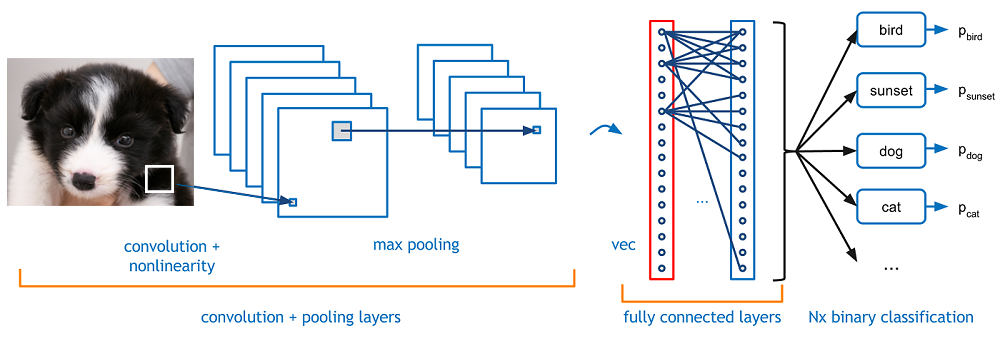
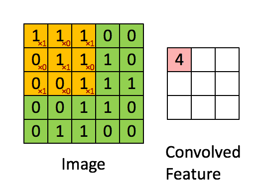
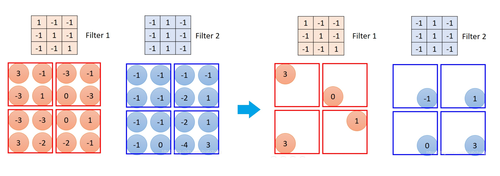
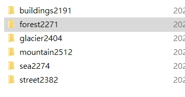
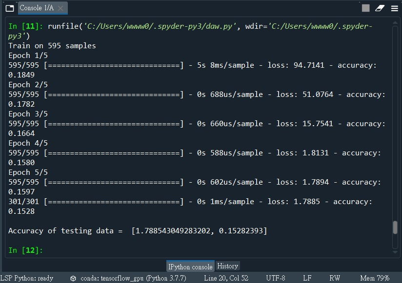

# 期末專案—圖片辨識
本程式與他校友人共同研究寫出。
### 為什麼以圖片辨識做為本次作業內容？
以自己手機的臉部辨識解鎖做為啟發點，總覺得手機能在短時間內僅用設定解鎖時提供的幾張圖像就辨識出使用者非常神奇，因此先從較為簡單的環境圖片做為本次作業 Deep Learning 的對象。
## CNN
* 本專案利用CNN（卷積神經網路）的框架來訓練模型。

>* Convolution主要用以擷取資料特徵。
>* Pooling為縮圖的動作，可以減少運算資料量。
### Convolution
* Convolution利用Kernel（卷積核）來進行運算。

### Max Pooling
* Max Pooling在每次縮圖時，取數值最大的像素留下來。

## Deep Learning的圖片
要辨識的圖片類型有六種，buildings, forest, glacier, mountain, sea, street，因此先分好六個資料夾，每個資料夾分別約有2000張圖片。

* 讀檔
```py
#training and testing初始化
x_train = np.zeros([1,150,150,3])
y_train = np.zeros([1,6])
x_test = np.zeros([1,150,150,3])
y_test = np.zeros([1,6])
```
讀取buildings類型資料，上下兩個迴圈分別加入training與testing資料。
```py
for i in range(1,1800):
    image = cv2.imread('.\\image_set\\buildings2191\\'+str(i)+'.jpg')
    image = image.reshape(1,150,150,3)
    x_train = np.append(x_train, image, axis=0)
    y_train = np.append(y_train, np_utils.to_categorical([0],6), axis=0)
    
for i in range(1800,2191):
    image = cv2.imread('.\\image_set\\buildings2191\\'+str(i)+'.jpg')
    image = image.reshape(1,150,150,3)
    x_test = np.append(x_test, image, axis=0)
    y_test = np.append(y_test, np_utils.to_categorical([0],6), axis=0)
```
讀取forest類型資料，其他類型，以此類推。
```py
for i in range(1, 1800):
    image = cv2.imread('.\\image_set\\forest2271\\'+str(i)+'.jpg')
    image = image.reshape(1, 28, 28, 1)
    x_train = np.append(x_train, image, axis=0)
    y_train = np.append(y_train, np_utils.to_categorical([1], 6), axis=0)
for i in range(1800, 2271):
    image = cv2.imread('.\\image_set\\forest2271\\'+str(i)+'.jpg')
    image = image.reshape(1, 28, 28, 1)
    x_test = np.append(x_test, image, axis=0)
    y_test = np.append(y_test, np_utils.to_categorical([0], 6), axis=0)
```
### 程式碼
為避免測試時學習時間過長，只讀取了前150張圖片。
```py
import numpy as np
import cv2
from tensorflow.keras.models import Sequential
from tensorflow.keras.layers import Dense, Dropout, Activation, Flatten
from tensorflow.keras.layers import Conv2D, MaxPooling2D
from tensorflow.keras.datasets import mnist
from tensorflow.python.keras.utils import np_utils
from matplotlib import pyplot as plt
#def load_data():
#    (x_train, y_train), (x_test, y_test) = mnist.load_data()
#    x_train = x_train.reshape(x_train.shape[0], 28, 28, 1)
#    x_test = x_test.reshape(x_test.shape[0], 28, 28, 1)
#    x_train = x_train.astype('float32')
#    x_test = x_test.astype('float32')
#    y_train = np_utils.to_categorical(y_train, 10)
#    y_test = np_utils.to_categorical(y_test, 10)
#   return (x_train, y_train), (x_test, y_test)
#(x_train, y_train), (x_test, y_test) = load_data()
x_train = np.zeros([1,28, 28, 1])
y_train = np.zeros([1,6])
x_test = np.zeros([1,28, 28, 1])
y_test = np.zeros([1,6])
model = Sequential()
model.add(Conv2D(filters=3, kernel_size=(3,3), activation='relu', input_shape=(28,28,1), data_format="channels_last"))
model.add(Conv2D(filters=10, kernel_size=(3,3), activation='relu'))
model.add(MaxPooling2D(pool_size=(2,2)))
model.add(Flatten())
model.add(Dense(units=20, activation = 'relu'))
model.add(Dense(units=20, activation = 'relu'))
model.add(Dense(units=10, activation='softmax'))
model.compile(loss='categorical_crossentropy', optimizer='adagrad', metrics=['accuracy'])
train_history = model.fit(x=x_train, y=y_train, epochs=5, batch_size=200)
result = model.evaluate(x_test, y_test)
print("\nAccuracy of testing data = ", result)
#deep learning

for i in range(1,1800):
    image = cv2.imread('.\\image_set\\buildings2191\\'+str(i)+'.jpg')
    image = image.reshape(1,28, 28, 1)
    x_train = np.append(x_train, image, axis=0)
    y_train = np.append(y_train, np_utils.to_categorical([0],6), axis=0)
for i in range(1800,2191):
    image = cv2.imread('.\\image_set\\buildings2191\\'+str(i)+'.jpg')
    image = image.reshape(1,28, 28, 1)
    x_test = np.append(x_test, image, axis=0)
    y_test = np.append(y_test, np_utils.to_categorical([0],6), axis=0)
for i in range(1,1800):
    image = cv2.imread('.\\image_set\\forest2271\\'+str(i)+'.jpg')
    image = image.reshape(1,28, 28, 1)
    x_train = np.append(x_train, image, axis=0)
    y_train = np.append(y_train, np_utils.to_categorical([1],6), axis=0)
for i in range(1800,2271):
    image = cv2.imread('.\\image_set\\forest2271\\'+str(i)+'.jpg')
    image = image.reshape(1,28, 28, 1)
    x_test = np.append(x_test, image, axis=0)
    y_test = np.append(y_test, np_utils.to_categorical([0],6), axis=0)
for i in range(1,1800):
    image = cv2.imread('.\\image_set\\glacier2404\\'+str(i)+'.jpg')
    image = image.reshape(1,28, 28, 1)
    x_train = np.append(x_train, image, axis=0)
    y_train = np.append(y_train, np_utils.to_categorical([1],6), axis=0)
for i in range(1800,2404):
    image = cv2.imread('.\\image_set\\glacier2404\\'+str(i)+'.jpg')
    image = image.reshape(1,28, 28, 1)
    x_test = np.append(x_test, image, axis=0)
    y_test = np.append(y_test, np_utils.to_categorical([0],6), axis=0)
for i in range(1,1800):
    image = cv2.imread('.\\image_set\\mountain2512\\'+str(i)+'.jpg')
    image = image.reshape(1,28, 28, 1)
    x_train = np.append(x_train, image, axis=0)
    y_train = np.append(y_train, np_utils.to_categorical([1],6), axis=0)
for i in range(1800,2512):
    image = cv2.imread('.\\image_set\\mountain2512\\'+str(i)+'.jpg')
    image = image.reshape(1,28, 28, 1)
    x_test = np.append(x_test, image, axis=0)
    y_test = np.append(y_test, np_utils.to_categorical([0],6), axis=0)
for i in range(1,1800):
    image = cv2.imread('.\\image_set\\sea2274\\'+str(i)+'.jpg')
    image = image.reshape(1,28, 28, 1)
    x_train = np.append(x_train, image, axis=0)
    y_train = np.append(y_train, np_utils.to_categorical([1],6), axis=0)
for i in range(1800,2274):
    image = cv2.imread('.\\image_set\\sea2274\\'+str(i)+'.jpg')
    image = image.reshape(1,28, 28, 1)
    x_test = np.append(x_test, image, axis=0)
    y_test = np.append(y_test, np_utils.to_categorical([0],6), axis=0)
for i in range(1,1800):
    image = cv2.imread('.\\image_set\\street2382\\'+str(i)+'.jpg')
    image = image.reshape(1,28, 28, 1)
    x_train = np.append(x_train, image, axis=0)
    y_train = np.append(y_train, np_utils.to_categorical([1],6), axis=0)
for i in range(1800,2382):
    image = cv2.imread('.\\image_set\\street2382\\'+str(i)+'.jpg')
    image = image.reshape(1,28, 28, 1)
    x_test = np.append(x_test, image, axis=0)
    y_test = np.append(y_test, np_utils.to_categorical([0],6), axis=0)
model = Sequential()
```
### 學習完成

---
### 參考資料
https://cinnamonaitaiwan.medium.com/cnn入門-圖像增強-fa654d36dafc

https://cinnamonaitaiwan.medium.com/深度學習-cnn原理-keras實現-432fd9ea4935

https://blog.csdn.net/Aibiabcheng/article/details/108114884

https://speech.ee.ntu.edu.tw/~tlkagk/courses.html

https://www.kaggle.com/kanncaa1/convolutional-neural-network-cnn-tutorial

https://www.edureka.co/blog/convolutional-neural-network/

https://www.kaggle.com/puneet6060/intel-image-classification/data